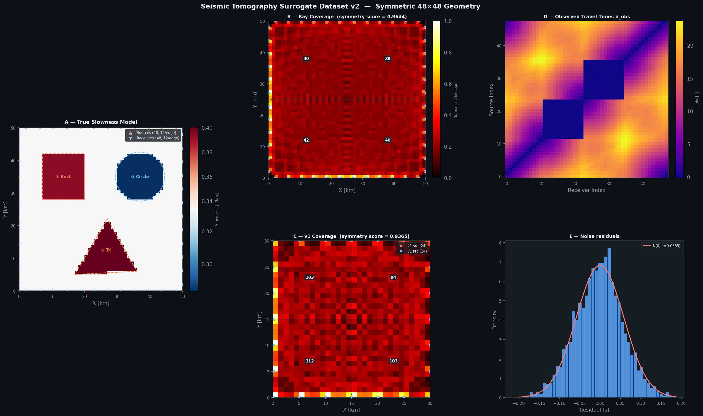
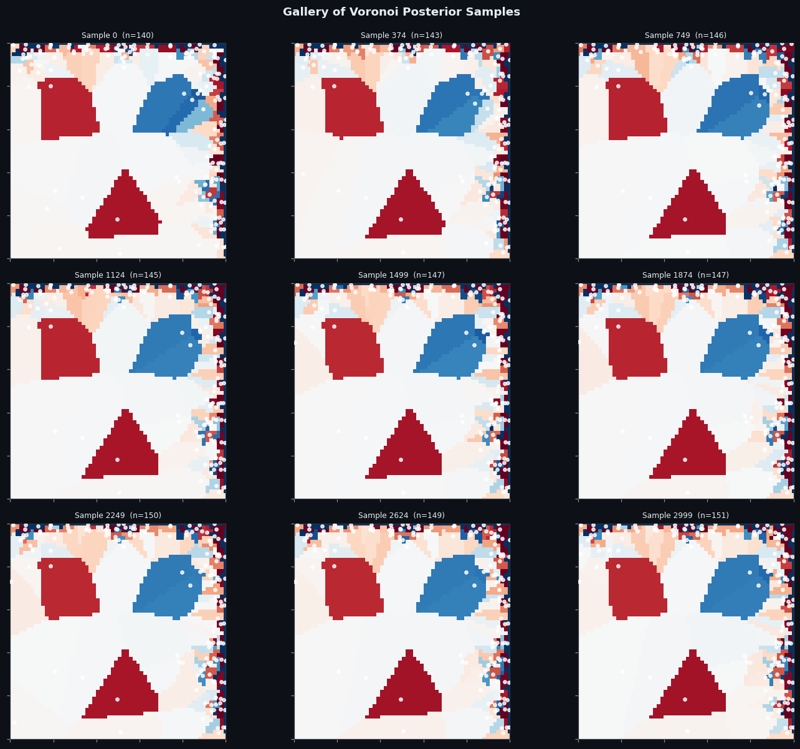
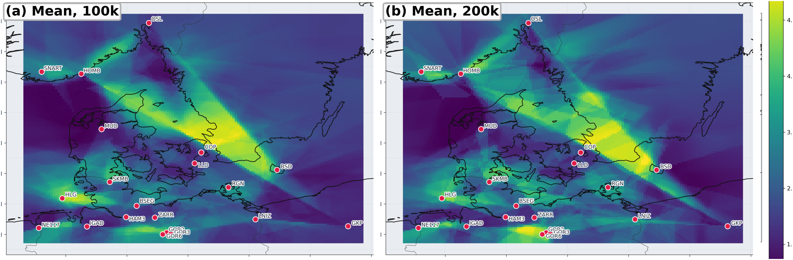
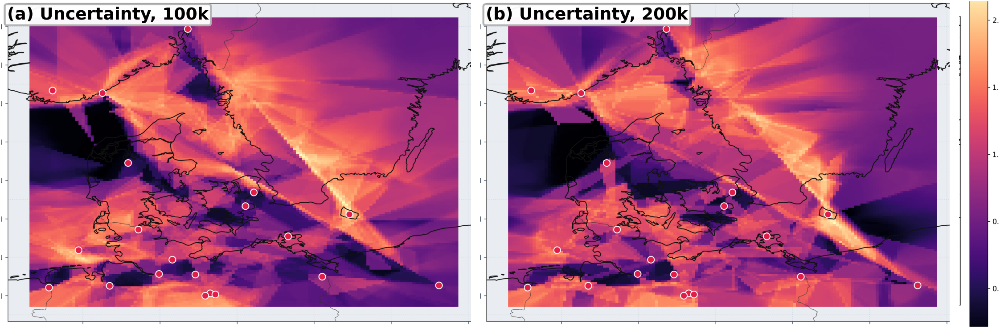

# Voronoi RJMCMC Seismic Tomography

Transdimensional seismic travel-time tomography using reversible-jump Markov chain Monte Carlo (rj-MCMC) with a Voronoi-cell parameterization, following Bodin & Sambridge (2009).

This project was developed for **Advanced Methods in Applied Statistics** at the Niels Bohr Institute, University of Copenhagen. The full write-up is in [`Transdimensional_seismic_tomography.pdf`](Transdimensional_seismic_tomography.pdf).

## Overview

Instead of inverting for slowness on a fixed grid, the subsurface is represented by a set of Voronoi cells. The number of cells, their positions and their slowness values are all unknowns. The sampler adds, removes and moves cells as it explores the posterior, so model complexity adapts to how much information the data carry. You get more cells where rays are dense and fewer where they are sparse.

The method is applied in two settings:

1. **Synthetic surrogate test** (`surrogate/`). A 50 × 50 km model with three anomalies (a rectangle, a circle and a triangle) is observed by 48 sources and 48 receivers along the edges. The sampler is checked by recovering the known model.
2. **Denmark tomography** (`denmark/`). Interstation travel times are extracted from ambient-noise cross-correlations of Danish Seismological Network (DK) waveforms and inverted with ensembles of 100k-step and 200k-step chains.

### Method

- Straight-ray forward model. Each ray is sampled at evenly spaced points, and cell membership comes from a k-d tree nearest-nucleus lookup.
- Gaussian likelihood and uniform priors on the number of cells (2–200), on slowness (0.18–0.62 s/km), and on nucleus positions.
- Proposals:
  - **Slowness update** on even steps.
  - **Geometry move** on odd steps, chosen from birth, death and nucleus move.
  - Two-stage **delayed rejection** on the fixed-dimension moves.
- A fixed ring of ghost nuclei outside the domain keeps the boundary cells under control (surrogate case).
- Multiple independent chains are run and combined into a posterior mean and uncertainty.

## Results

### Surrogate test

| True model and ray geometry | Posterior samples (50k steps) |
|---|---|
|  |  |

The anomalies are recovered well. The left and top edges are over-parameterized because of the sensor layout; the report discusses this. Longer-run results with error and residual maps are in [`surrogate/figures/results_long_run.png`](surrogate/figures/results_long_run.png).

### Denmark

| Posterior mean velocity | Posterior uncertainty |
|---|---|
|  |  |

Both ensembles recover the same large-scale structure. Uncertainty is lowest where ray coverage is densest. The 200k ensemble explores somewhat higher model complexity (see [`paper_posterior_ncells_compare.png`](denmark/figures/paper_posterior_ncells_compare.png)).

## Repository structure

```
Transdimensional_seismic_tomography.pdf   the report

surrogate/
  generate_surrogate_dataset.py      builds the synthetic model + travel times  (Fig. 1)
  rjmcmc_surrogate.ipynb             step-by-step rj-MCMC walkthrough           (Fig. 2)
  run_chains.py                      faster script version, single or multi-chain
  data/                              surrogate datasets (.npz)
  figures/                           selected result figures

denmark/
  01_get_data.py                     download DK waveforms, cross-correlate, pick travel times
  02_voronoi_rjmcmc.py               run one rj-MCMC chain on a ray CSV
  03_run_chains.py                   launch chains back-to-back into a campaign folder
  04_combine_posteriors.py           pool chains: diagnostics, posterior maps   (Figs 3, 5–10)
  05_make_paper_figures.py           assemble the compact report figures
  figures/                           figures used in the report
```

## Reproducing the results

```bash
pip install -r requirements.txt
```

### Surrogate

```bash
cd surrogate
python generate_surrogate_dataset.py            # writes data/surrogate_seismic_dataset_v2.npz
jupyter notebook rjmcmc_surrogate.ipynb          # the run used in the report (50k steps)
python run_chains.py --dataset v2 --nchains 4    # optional: parallel chains, output in outputs/
```

### Denmark

Raw waveforms and chain outputs are not included because of their size. The pipeline is:

```bash
# 1. Travel times from DK network noise cross-correlations (downloads data via FDSN)
python denmark/01_get_data.py --start <YYYY-MM-DD> --end <YYYY-MM-DD> --outdir denmark_data_run

# 2+3. Run chains until STOP_CHAINS.txt is created in the campaign folder
python denmark/03_run_chains.py --csv denmark_data_run/csv/ray_data_denmark.csv \
    --run-name denmark_100k --period <s> --min-snr <snr> --min-days <days> \
    --n-steps 100000 --burn 20000 --thin 20

# 4. Combine chains into posterior maps and diagnostics
python denmark/04_combine_posteriors.py --chains-root chains/denmark_100k --outdir results_100k

# 5. Report figures from the 100k and 200k ensembles
python denmark/05_make_paper_figures.py --dir-100k results_100k --dir-200k results_200k --outdir denmark/figures
```

The report used 20 chains of 100,000 steps (burn-in 20,000, thin 20) and 11 chains of 200,000 steps (burn-in 40,000, thin 40).

## Notes

- **Two sampler implementations.** The surrogate and Denmark samplers implement the same algorithm separately. They are kept as they were when the report's results were produced.
- **Missing surface-material background.** Fig. 3 draws the ray coverage over harmonized surface-material maps. The helper that fetched those maps from a WFS service has been lost. `04_combine_posteriors.py` therefore produces the ray-coverage map without that background, and the original Fig. 3 image is kept in `denmark/figures/paper_context_overlay.png`.
- **Crop boxes may need adjusting.** `05_make_paper_figures.py` crops panels out of the images that `04` writes. If you change the layout in `04`, update the crop fractions too.

## Authors

Pelle Rechnagel, Søren Gundesen, Nicholas Posborg, Sebastian Hjaltelin
University of Copenhagen, Niels Bohr Institute, 2026

## References

T. Bodin and M. Sambridge, *Seismic tomography with the reversible jump algorithm*, Geophysical Journal International **178**, 1411–1436 (2009).
